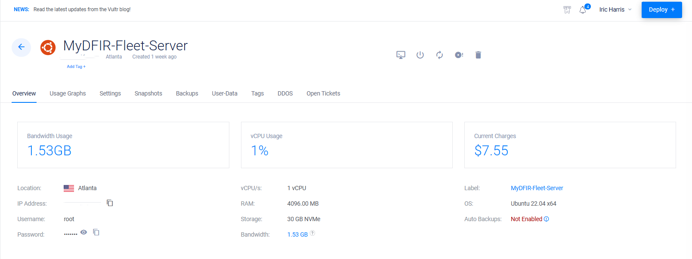
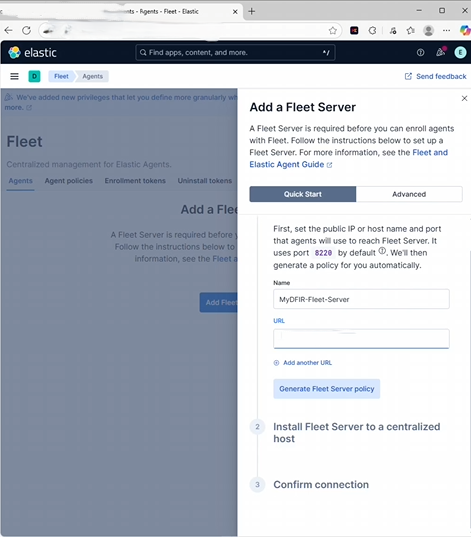
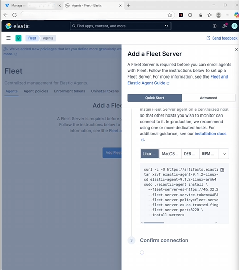

# 🚀 Elastic Agent & Fleet Server Setup — Vultr (Ubuntu 22.04) + Windows Agent

This project documents how I deployed **Fleet Server** on **Ubuntu 22.04 (Vultr)**, enrolled a **Windows Server 2022** endpoint with **Elastic Agent**, fixed port/URL issues (`8220` vs `443`), and verified logs in **Kibana**.

> 🔐 **Public repo note:** I redact/blur real IPs/tokens. Use placeholders like `203.0.113.25` (public) and `10.0.0.x` (private).

---

## 📌 Project Overview
- **Cloud:** Vultr (VPC 2.0 selected for Fleet Server)
- **Stack UI:** Kibana (`http://<elastic-public-ip>:5601`)
- **Fleet Server Host:** Ubuntu 22.04
- **Endpoint:** Windows Server 2022 (pre-deployed)
- **Goal:** Manage agents centrally with Fleet and confirm Windows logs in Kibana

---

## 🧱 Lab Architecture

| Component               | Role              | Ports (final)                                       |
|------------------------|-------------------|-----------------------------------------------------|
| Ubuntu 22.04 (Vultr)   | Fleet Server      | **8220/tcp** (from trusted IPs), **22/tcp** (SSH)   |
| Windows Server 2022    | Elastic Agent     | Outbound to Fleet Server **8220**                   |
| Kibana                 | UI                | **5601/tcp** (from my IP)                           |
| Elasticsearch          | Backend           | **9200/tcp** (internal; allowed during setup)       |

📸 *Diagram placeholder*  


---

## ✅ Prerequisites
- Running **Elasticsearch + Kibana** (from prior repo)
- Kibana reachable at: `http://<elastic-public-ip>:5601`
- Credentials with enough privileges (e.g., `elastic`)
- 1× Vultr Ubuntu 22.04 VM (Fleet Server) with **VPC 2.0**
- 1× Windows Server 2022 VM (Elastic Agent target)
- Your **public IP** (to restrict firewall rules)

---

## 🛠️ Steps (What I Actually Did)

### **Step 1 — Deploy Fleet Server VM (Vultr)**
- Deployed new server: **Cloud Compute (CPU)**
- **Image:** Ubuntu 22.04
- **Networking:** Selected **VPC 2.0** (ensure network is checked)
- **Hostname/Label:** Set and deployed

📸 *Screenshots:*  
  
  


---

### **Step 2 — Start Fleet Quick Start in Kibana**
- Open Kibana:
http://<elastic-public-ip>:5601

markdown
Copy
Edit
- **Management → Fleet → Add Fleet Server**
- Chose **Quick start**
- Entered:
- **Name**: `fleet-server-01`
- **URL**: `https://<fleet-server-public-ip>` (**must be https**)
- Clicked **Generate** to get the Linux install command

📸 *Screenshots:*  
  


---

### **Step 3 — SSH to Fleet Server & Update**
```bash
ssh root@<fleet-server-public-ip>

# Update repository & packages
apt-get update && apt-get upgrade -y
📸 Screenshots:


Step 4 — Install Fleet Server (Paste Command From Kibana)
From Kibana’s “Install Fleet Server to a centralized host (Step 2)”, I copied the generated command and ran it on the Ubuntu VM.

bash
Copy
Edit
# Example placeholder — use the EXACT command from Kibana
sudo ./elastic-agent install \
  --fleet-server-es=https://<elasticsearch-host>:9200 \
  --fleet-server-service-token=<SERVICE_TOKEN> \
  --fleet-server-policy=<FLEET_SERVER_POLICY_ID_OR_NAME> \
  --url=https://<fleet-server-public-ip>:8220
# In this lab I later used --insecure until certs were sorted
📸 Screenshot:

Step 5 — Firewall Adjustments (Cloud + Host)
During setup I opened broader ranges, then tightened later.

Vultr firewall (cloud):

Temporary: allowed TCP 1–65535 from my public IP (to get enrollment working)

Final (recommended): allow 22/tcp (SSH) and 8220/tcp (Fleet) from my IP only

📸 Screenshots:


UFW on ELK host (to allow stack ports during setup):

bash
Copy
Edit
sudo ufw allow 9200/tcp     # Elasticsearch API (allowed during setup)
sudo ufw allow 5601/tcp     # Kibana UI if needed from my IP
sudo ufw status
UFW on Fleet Server host:

bash
Copy
Edit
sudo ufw allow 8220/tcp     # Fleet Server
sudo ufw allow 443/tcp      # Added during troubleshooting
sudo ufw status
📸 Screenshot:

🔐 Best practice: keep both layers (Vultr + UFW) restricted to your IP; don’t leave broad ranges open.

Step 6 — Continue Wizard & Create Agent Policy
In Kibana, clicked Continue

Created a new Agent Policy (e.g., Windows-Endpoint-Policy)

Saved policy (can add Windows + System integrations later)

📸 Screenshot:

Step 7 — Install Elastic Agent on Windows
Logged into the Windows Server 2022 machine

Opened PowerShell (Run as Administrator)

From Kibana → Fleet → Add agent, copied the Windows install command and pasted it:

powershell
Copy
Edit
# Example placeholder — use YOUR exact command from Kibana’s Add agent page
.\elastic-agent.exe install `
  --url=https://<fleet-server-public-ip>:8220 `
  --enrollment-token=<AGENT_ENROLLMENT_TOKEN> `
  --insecure
Used --insecure to bypass self-signed cert errors in this lab

📸 Screenshots:


Step 8 — Fix Fleet URL Port (8220 vs 443)
In Kibana → Fleet → Settings, I edited the Fleet Server host URL to include :8220 (not :443)

Also modified the agent install URL to use :8220

Kept --insecure during lab while certs were not in place

📸 Screenshots:


Step 9 — Verify Enrollment & Logs
Fleet → Fleet servers: shows Healthy/Online

Fleet → Agents: Windows agent Online

Discover: Windows logs arriving (e.g., logs-windows.*, metrics-system.*)

📸 Screenshots:
